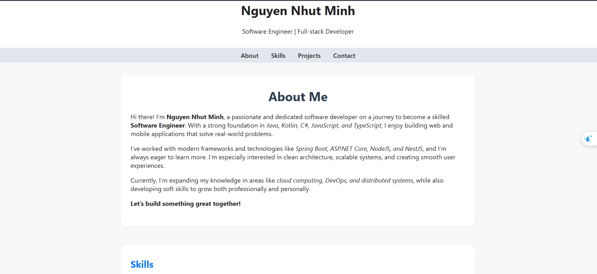

# Personal Portfolio Website

This is my personal portfolio website built using **HTML**, **CSS**, and **JavaScript**

## Preview

---

## Features

- Skills categorized by stack
- Project showcase
- Easy deployment with GitHub Pages

---

## Technologies Used

- **HTML**
- **CSS**
- **JavaScript**

---

## Sections

- `About`: Who I am, my interests and background
- `Skills`: My programming languages and frameworks/tools
- `Projects`: My past work and portfolio
- `Contact`: How to get in touch with me
- `Footer`: Copyright

---

## Contact

- Email: nhutminhnguyen293@gmail.com
- GitHub: https://github.com/nhutminhnguyen273